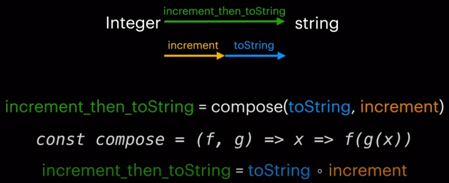

# Functional Programming Basics (in TypeScript)

> A follow-along with the [Functional Programming with TypeScript](https://www.youtube.com/playlist?list=PLuPevXgCPUIMbCxBEnc1dNwboH6e2ImQo) YouTube playlist by [Web Village Voyage](https://www.youtube.com/@webvv) (Sahand Javid).

Sahand Javid's videos on FP with TS are terrific! His explanation of concepts and use of examples is very clear. The progression from topic to topic and video to video is well crafted. Each video is also short (from ~4 to ~18 minutes long), which makes the very digestible.

- [ ] Bundle sets of videos into a single lesson. E.g.: 01 through 04
  - [ ] Bundling his short videos into sets creates content that is suitable for a typical one or two hour class period, when combined with examples, practice and Socratic learning techniques.
- [ ] Create interrogative questions/dialog for each video to help the student recall, process and integrate the video's content into their personal learning and comprehension.

----

## 03: Function Composition



```ts
// Imagine a function that increments a number:
//      int --> int
const increment:int = (num:int) => num + 1;
// Imagine a function that produces the string representation of a number:
//      int --> string
const toString:string = (num:int) => num.toString();

// Imagine we wanted to combine the effects of these functions.
// They are composable because the output of the `increment` function (an int)
// is compatible with the input of the `toString` function (an int)

// Function composition is the idea that your inputs can be functions and the
// output (or result) is also a function.
// In this example, the inputs of `compose` are `f` and `g`, which are functions.
// Another way of saying this is that `compose` is the product of `f` and `g`, or
//      compose = f * g
// The plain JavaScript for the `compose` function would be
const compose = (f, g) => x => f(g(x))
```

----

> ### Bing Conversation A
>
> > **Q)** *In TypeScript how to you declare the type of a variable when that type is a function?*
>
> According to ¹, you can declare the type of a variable that is a function by using the syntax `var x: () => boolean;` where `x` is the variable name and `boolean` is the return type of the function. You can assign a function that matches this type signature to the variable, and call it by using `x()`. For example:
>
> ```typescript
> function boolfn() {
>   return true;
> }
>
> var x: () => boolean;
> x = boolfn; // OK
> var y = x(); // y: boolean
> ```
>
> Source: Conversation with Bing, 2023-05-24
> (1) TypeScript variable that is a typed function - Stack Overflow. https://stackoverflow.com/questions/19819787/typescript-variable-that-is-a-typed-function.
> (2) TypeScript: Documentation - Variable Declaration. https://www.typescriptlang.org/docs/handbook/variable-declarations.html.
> (3) TypeScript - Variables - Online Tutorials Library. https://www.tutorialspoint.com/typescript/typescript_variables.htm.
> (4) How to define variables in TypeScript? - LearnCodeWeb. https://learncodeweb.com/typescript/how-to-define-variables-in-typescript/.

----

> ### Bing Conversation B
>
> > **Q)** *In your example, how would it be defined if the input of the function `x` is a number and the output of the function `x` is a boolean? Remember to give your answer as TypeScript.*
>
> If the input of the function `x` is a number and the output of the function `x` is a boolean, then the type of the variable `x` would be `(n: number) => boolean`. For example:
>
> ```typescript
> function isEven(n: number) {
>   return n % 2 === 0;
> }
>
> var x: (n: number) => boolean;
> x = isEven; // OK
> var y = x(42); // y: boolean
> ```

----

## 04: Function Composition demo

